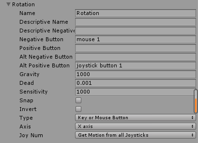

### Unity Input 20190408
1. Unity 鼠标键盘输入
   + Input.GetAxis("Rotation")
   + Editor->Project Setting->Input中配置
   + 鼠标右键+鼠标x轴移动进行旋转。 (相机GameObject)  
    
    ```
    float h = Input.GetAxis("Mouse X");
    float rotationDelta = Input.GetAxis("Rotation");
    if (rotationDelta != 0f) {
        AdjustRotation(h);
    }
    void AdjustRotation (float delta) {
		    rotationAngle += delta * rotationSpeed * Time.deltaTime;
		    if (rotationAngle < 0f) {
			        rotationAngle += 360f;
		    }
		    else if (rotationAngle >= 360f) {
			        rotationAngle -= 360f;
		    }
		    transform.localRotation = Quaternion.Euler(0f, rotationAngle, 0f);
	  }
    ```
2. Input中配置按键名称。鼠标右键 mouse 1  鼠标左键 mouse 0 鼠标中间 mouse 2
```
    普通键：“a”，“b”，“c”......
    数字键：“1”，“2”，“3”，......
    箭头键：“up”, “down”, “left”, “right”
    键盘键：“[1]”, “[2]”, “[3]”, “[+]”, “[equals]”
    修改键：“right shift”, “left shift”, “right ctrl”, “left ctrl”, “right alt”, “left alt”, “right cmd”, “left cmd”
    鼠标按钮：“mouse 0”, “mouse 1”, “mouse 2”, …
    操纵杆按钮（来自任意操纵杆）：“joystick button 0”, “joystick button 1”, “joystick button 2”,
    操纵杆按钮（来自特定操纵杆）：“joystick 1 button 0”, “joystick 1 button 1”, “joystick 2 button 0”, …
    特殊键： “backspace”, “tab”, “return”, “escape”, “space”, “delete”, “enter”, “insert”, “home”, “end”, “page up”, “page down”
    功能键：“f1”，“f2”，“f3”

  ```
