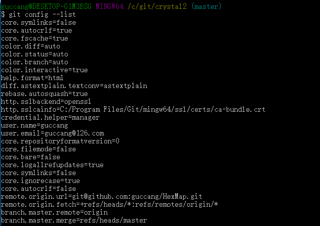

# git操作
## git help
git 帮助手册
```
  git help conifg
  git help add
  git help commit
  git help remote
```

## git config
1. git config 配置文件存放位置
  + /etc/gitconfig etc目录下的gitconfig文件
  + ~/.gitconfig 用户目录下的.gitconfig文件
  + .git 工程目录下

2. --global 配置 用于目录下的.gitconfig文件
git --global user.name ""
git --global user.email ""
```
[user]
        name = guccang@126.com
        email = guccang@126.com
[core]
        autocrlf = false
        excludesfile = C:/Users/.gitignore
```
* 多个git库如何配置config 文件. 在.git/config中配置不同的url


* git config --list
```
  使用 --list 查看gitxiangguan相关配置
  在不同目录下,查看到的key value值个数不同
  在etc下只有etc/gitconfig值
  在~/下包含etc 和 ~/.gitconfig 两个目录的值
  在工程.git目录下包含了.git/config ~/.gitconfig /etc/gitconfig 三个文件的所有值
  相同key的, 后面的值覆盖前面的值。
```


## git ssh配置
 * 在用户home目录下去，然后电泳ssh-keygen生成rsa
 ```
  cd ~/
  ssh-keygen -t rsa -C "yourmail@qq.com"
 ```
 * mark by ztj todo
  *  如何配置git命令的rsa目录,目前只能是默认~/.ssh/rsa

## git remote
git remote -v  查看本地分支关联远端分支路径,未关联为null。

* remote add
```
关联本地分支到远端git路径
git remote add  origin git@github.com:guccang/HexMap.git
```
* git remote -v

  

* git push origin master
```
  将本地分支同步到远端对应的master分支
```

* git push --set-upstream origin master
```
  将本地分支追踪
```
